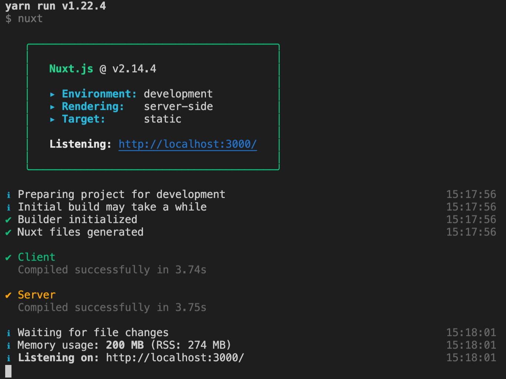
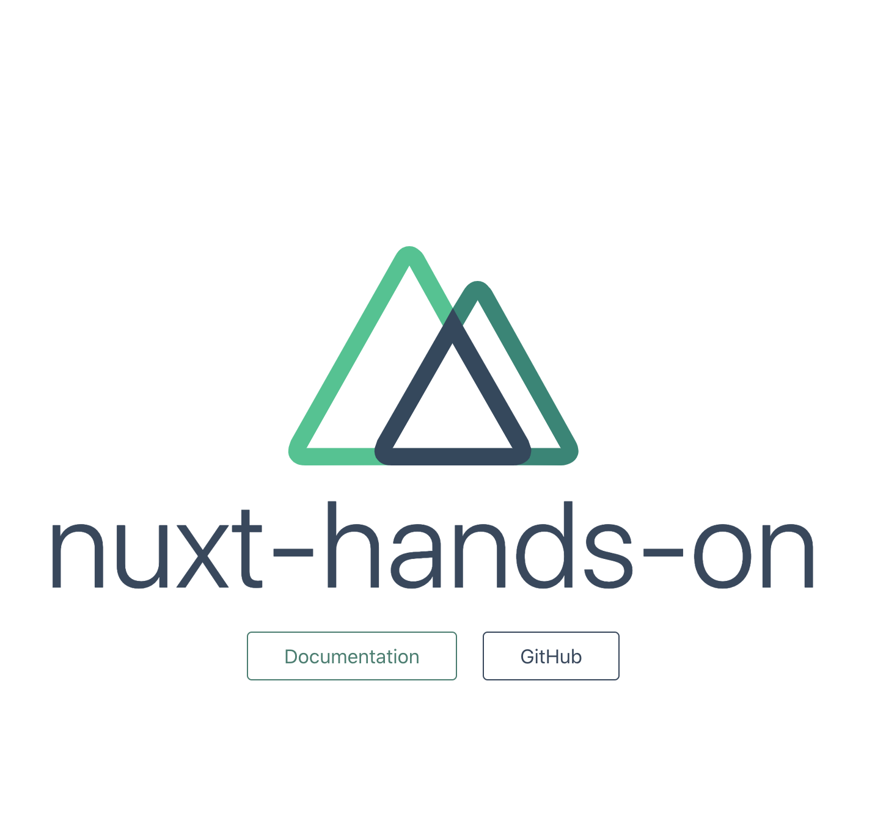

# 初めてのNuxtアプリ

## ゴール

Nuxtのデフォルト画面を表示させる。

## 手順

```
1.Nuxtプロジェクトを作成する
2.開発者モードで立ち上げる
3.静的サイトを作成する
```

## 1.Nuxtプロジェクトを作成する

ターミナルでデスクトップに移動し、下記コマンドでNuxtプロジェクトを作成。

```
create-nuxt-app nuxt-hands-on
```

対話式で設定を聞かれるので、下記のように設定。

```
create-nuxt-app nuxt-hands-on

create-nuxt-app v3.1.0
✨  Generating Nuxt.js project in nuxt-hands-on

# プロジェクト名
? Project name: nuxt-hands-on 

# JavaScriptで書くかTypeScriptで書くか
? Programming language: JavaScript

# npm を使うか Yarnを使うか
? Package manager: Yarn 

# Vue.js用のCSSのフレームワークを使うか
? UI framework: None 

# プラグインを追加するかどうか（後で追加するがここでは何も選択しないでOK）
? Nuxt.js modules: (Press <space> to select, <a> to toggle all, <i> to invert se
lection) 

# ESLintなど追加するか
? Linting tools: (Press <space> to select, <a> to toggle all, <i> to invert sele
ction)　

# Testツールを追加するか
? Testing framework: None 

# サーバーサイドレンダリングするか、Vue.jsのアプリを作るか
? Rendering mode: Universal (SSR / SSG) 

# nodeのプログラムとして動かすか、シンプルなウェブページとするか
? Deployment target: Static (Static/JAMStack hosting) 

# 何のツールか分からないが、VS Codeを使っているのでjsconfig.jsonをいつも選択している
? Development tools: (Press <space> to select, <a> to toggle all, <i> to invert
selection)　
❯◯ jsconfig.json (Recommended for VS Code)
 ◯ Semantic Pull Requests
```

## 2.開発者モードで立ち上げる

ターミナルで`nuxt-hands-on`ディレクトリに移動し、下記コマンドを実行。

```
yarn dev
```

下記のように表示されたら成功。



http://localhost:3000/ へアクセスするとNuxのデフォルト画面が表示される。



開発者モードで開いているので、中のコードを変更すると即座に反映される。<br>
<br>
pages/index.vueをエディタで開きh1タグを下記と置き換えて見ると反映される事を確認出来る。

```html
<h1 class="title">
  初めてのNuxtアプリ
</h1>
```

## 3.静的サイトを作成する

### 静的サイトを作成する

`ctrl + d`でアプリを止めた後、下記コマンドを順に実行する。

```
# ビルドする
yarn build

# 静的サイトに変換する
npx nuxt generate
```

プロジェクトディレクトリ直下に`dist`ディレクトリが作成される。<br>
このディレクトリに静的サイトのファイルがまとめられている。

### 静的サイトをブラウザで表示する

デスクトップに`web`ディレクトリを作成し、作成された`dist`内のファイルを全て`web`に移動（複製でもOK）。<br>
`web`をエディタで開き、エディタのプレビュー機能でサイトを開くと、先ほどと同じものが表示される。

## 出来るようになった事

- Nuxtアプリ作成時に聞かれる質問の意味の理解
- 開発者モードでのアプリの立ち上げ方法
- 静的サイトの作成方法