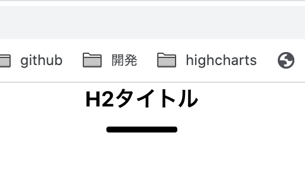
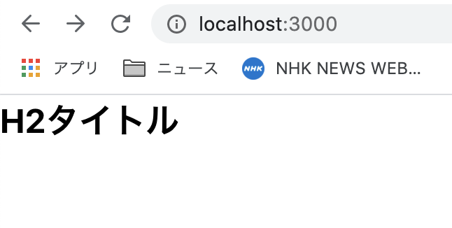

# 初めてのコンポーネント

## ゴール

Nuxtページを構成するパーツであるコンポーネントを作成する。<br>
ここでは下図のタイトルコンポーネントを完成させる。



## 手順

```
1.componentsとは？
2.Titleコンポーネントを作成する
3.スタイルを調整する
4.コンポーネントにデータを渡す
```

## 1.componentsとは？

ページを構成するパーツ。複数のcomponentが組み合わせる事でVueのページは作られる。<br>
<br>
components配下にvue拡張子のファイルを作成するとcomponentとして扱われる。Nuxtプロジェクト内で使い回す事が出来る。<br>
<br>
また、pages配下にvue拡張子のファイルを作成するとURLを持つページとして扱われる。

## 2.Titleコンポーネントを作成する

components配下に`Title.vue`ファイルを作成し下記をコピペする。汎用的に使えるh2のタイトルを想定。

```vue
<template>
  <h2>H2タイトル</h2>
</template>
```

`pages/index.vue`ファイルを下記に変更

```vue
<template>
  <div>
    <Title />
  </div>
</template>
```

下記のようにブラウザで表示されればＯＫ。



## 3.スタイルを調整する

```
3-1.スタイルを適用する
3-2.scopedとは？
3-3.Sassを使うには？
```

### 3-1.スタイルを適用する

Title.vueを開き中身を下記と置き換えてスタイルが変更される事を確認する。

```vue
<template>
  <h2>H2タイトル</h2>
</template>

<style scoped>
h2 {
  font-size: 18px;
  font-weight: bold;
  text-align: center;
  color: red;
}
</style>
```

### 3-2.scopedとは？

各Vueファイルのスタイルは、そのファイル内の\<style\>タグ内で設定出来る。<br>
<br>
\<style scoped\>とすると、そこで記述されたスタイルはそのコンポーネント・ページのみで有効のものとなる。<br>
<br>
全てのコンポーネント・ページで共通のCSSを書く場所は、後で紹介する。

### 3-3.Sassを使うには？

デフォルトでは使えないので、モジュールをインストールする。

```
yarn add node-sass sass-loader
```

Title.vueを下記に置き換える。

```vue
<template>
  <h2>H2タイトル</h2>
</template>

<style lang="scss" scoped>
h2{
  font-size: 18px;
  font-weight: bold;
  text-align: center;
  margin-bottom: 1em;
  position: relative;
  &::before{
    content: '';
    position: absolute;
    bottom: -15px;
    display: inline-block;
    width: 60px;
    height: 5px;
    left: 50%;
    transform: translateX(-50%);
    background-color: black;
    border-radius: 2px;
  }
}
</style>
```

Sassが有効になった事を確認出来る。


## 4.コンポーネントにデータを渡す

```
4-1.データを渡すとは？
4-2.データを渡す
4-3.データを受け取る
```

### 4-1.データを渡すとは？

今回の汎用的に使いたいTitleコンポーネントなど、中身の文字を入れ替える事で使い回したい場合に使う。<br>
<br>
Titleコンポーネントを使うページで、中身の文字をTitleコンポーネントに渡すという事が出来る。ここではその渡す内容の事をデータと言っている。属性を渡すとかプロパティを渡すと言われている場合もある。

### 4-2.データを渡す

Titleコンポーネントを使うページで、中身の文字をTitleコンポーネントに渡すには、pages/index.vueを下記と置き換える。

```vue
<template>
  <div>
    <Title content="特集一覧" />
  </div>
</template>
```

### 4-3.データを受け取る

使う側から渡されたデータを受け取るには、Title.vueを下記と置き換える。<br>
<br>
ポイントは２つ。データを受け取るには`props`を指定する。`props`に配列で受け取るデータ名（属性名）を記述する。すると、変数として呼び出し側から受け取ったデータを使うことが出来る。<br>
<br>
変数の中身をVueファイルで表示させるには、変数をマスタッシュ（ {{ }} ）で括る。

```vue
<template>
  <h2>{{ content }}</h2>
</template>

<script>
export default {
  props: ["content"]
}
</script>

<style lang="scss" scoped>
h2{
  font-size: 18px;
  font-weight: bold;
  text-align: center;
  margin-bottom: 1em;
  position: relative;
  &::before{
    content: '';
    position: absolute;
    bottom: -15px;
    display: inline-block;
    width: 60px;
    height: 5px;
    left: 50%;
    transform: translateX(-50%);
    background-color: black;
    border-radius: 2px;
  }
}
</style>
```

## 出来るようになった事

・コンポーネントの作成
・Sassを使う
・コンポーネント間でデータの受け渡しをする