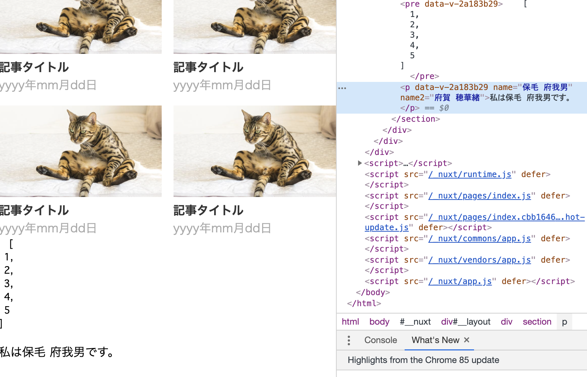

# 配列から作るカード型リンク

## ゴール

配列の内容を元に、記事一覧を作成する。記事とその一覧ページの構成のサイトを想定。下図を作成する。


## 手順

```
1.記事一覧を作成する
2.リセットCSSを追加する
3.記事のサムネを追加する
4.各リンクをコンポーネントにする
5.配列から記事一覧を作る
6.各リンクに配列の各データを反映する
```

## 1.記事一覧を作成する

pages/index.vueを下記に変更する。

```vue
<template>
  <section>
    <Title content="特集一覧" />
    <ul class="list">
      <li class="item">
        <a class="item__link" href="">
          <p class="item__title">記事タイトル</p>
          <time class="item__date">yyyy年mm月dd日</time>
        </a>
      </li>
      <li class="item">
        <a class="item__link" href="">
          <p class="item__title">記事タイトル</p>
          <time class="item__date">yyyy年mm月dd日</time>
        </a>
      </li>
      <li class="item">
        <a class="item__link" href="">
          <p class="item__title">記事タイトル</p>
          <time class="item__date">yyyy年mm月dd日</time>
        </a>
      </li>
      <li class="item">
        <a class="item__link" href="">
          <p class="item__title">記事タイトル</p>
          <time class="item__date">yyyy年mm月dd日</time>
        </a>
      </li>
    </ul>
  </section>
</template>

<style lang="scss" scoped>
.list{
  max-width: 960px;
  margin: 0 auto;
  display: flex;
  flex-wrap: wrap;
  justify-content: space-between;
}

.item {

  width: calc(50% - 8px);
  margin-top: 1em;
  
  &__link{
    display: block;
    text-decoration: none;
  }

  &__title {
    font-weight: bold;
    color: #333;
  }
  &__date {
    color: #aaa;
  }
}
</style>
```


## 2.リセットCSSを追加する

全てのページの外側の枠、HTML構造で言うwrapperとなるファイルの役割をするのが`layouts`配下のVueファイル。<br>
<br>
`layouts/default.vue`を下記と置き換える。<br>
<br>
reset.cssファイルを作成して読ませる事も可能（多分より一般的な方法）。シンプルに実装するために、今回は`layouts`配下のファイルにリセットCSSを書く。

```vue
<template>
  <div>
    <Nuxt />
  </div>
</template>

<style>
*{
  padding: 0;
  margin: 0;
  box-sizing: border-box;
}
ul{
  list-style-type: none;
}
img{
  max-width: 100%;
}
</style>
```

## 3.記事のサムネを追加する

```
3-1.画像をstaticディレクトリに配置する
3-2.画像を表示する
```

### 3-1.画像をstaticディレクトリに配置する

画像はstaticディレクトリ、またはassetsディレクトリに置くルール。<br>
<br>
webpackで画像容量を小さくするなど処理を入れたい場合はassetsに置く（別途設定必要）。特に何もしないならばstaticに置く。<br>
<br>
画像のzipフォルダを下記よりDLし解凍する。解凍後に、staticに配置する。<br>
https://nuxt-hands-on.s3.ap-northeast-2.amazonaws.com/image.zip

### 3-2.画像を表示する

pages/index.vueを下記と置き換える。差分は\<figure\>が追加されているかどうか。<br>
`static`ディレクトリの画像を読むためのパスは、例えば、`static/image/mv.jpg`を読みたい場合`/image/mv.jpg`または`image/mv.jpg`となる。<br>
<br>
/news/special/hogehogeというようにサブドメインでサイトを運用したい場合、'/'を付けると上手く画像を読めないので注意。

```vue
<template>
  <section>
    <Title content="特集一覧" />
    <ul class="list">
      <li class="item">
        <a class="item__link" href="">
          <figure class="item__img"></figure>
          <p class="item__title">記事タイトル</p>
          <time class="item__date">yyyy年mm月dd日</time>
        </a>
      </li>
      <li class="item">
        <a class="item__link" href="">
          <figure class="item__img"></figure>
          <p class="item__title">記事タイトル</p>
          <time class="item__date">yyyy年mm月dd日</time>
        </a>
      </li>
      <li class="item">
        <a class="item__link" href="">
          <figure class="item__img"></figure>
          <p class="item__title">記事タイトル</p>
          <time class="item__date">yyyy年mm月dd日</time>
        </a>
      </li>
      <li class="item">
        <a class="item__link" href="">
          <figure class="item__img"></figure>
          <p class="item__title">記事タイトル</p>
          <time class="item__date">yyyy年mm月dd日</time>
        </a>
      </li>
    </ul>
  </section>
</template>

<style lang="scss" scoped>
.list{
  max-width: 960px;
  margin: 0 auto;
  display: flex;
  flex-wrap: wrap;
  justify-content: space-between;
}

.item {

  width: calc(50% - 8px);
  margin-top: 1em;
  
  &__link{
    display: block;
    text-decoration: none;
  }

  &__title {
    font-weight: bold;
    color: #333;
  }
  &__date {
    color: #aaa;
  }
}
</style>
```


## 4.各リンクをコンポーネントにする

```
4-1.Linkコンポーネントを作成
4-2.Linkコンポーネントを表示
```

### 4-1.Linkコンポーネントを作成

components配下に`Link.vue`ファイルを作成し下記をコピペする（liの中身をLinkコンポーネントに移す）。

```vue
<template>
  <li class="item">
    <a class="item__link" href="">
      <figure class="item__img"></figure>
      <p class="item__title">記事タイトル</p>
      <time class="item__date">yyyy年mm月dd日</time>
    </a>
  </li>
</template>

<style lang="scss" scoped>
.item {
  
  &__link{
    display: block;
    text-decoration: none;
  }

  &__title {
    font-weight: bold;
    color: #333;
  }
  &__date {
    color: #aaa;
  }
}
</style>
```

### 4-2.Linkコンポーネントを表示

pages/index.vueを下記と置き換える。

```vue
<template>
  <section>
    <Title content="特集一覧" />
    <ul class="list">
      <Link class="item" />
      <Link class="item" />
      <Link class="item" />
      <Link class="item" />
    </ul>
  </section>
</template>
<style lang="scss" scoped>
.list{
  max-width: 960px;
  margin: 0 auto;
  display: flex;
  flex-wrap: wrap;
  justify-content: space-between;

  .item {
    width: calc(50% - 8px);
    margin-top: 1em;
  }
  
}
</style>
```

## 5.配列から記事一覧を作る

```
5-1.変数や配列を\<template\>内で扱う
5-2.dataメソッドで変数を登録する
5-3.dataメソッドの特徴
5-4.記事一覧の配列を作る
5-5.配列を回して記事一覧を表示する
```

### 5-1.変数や配列を\<template\>内で扱う

pages/index.vueの\<template\>を下記と置き換える。

```vue
<template>
  <section>
    <Title content="特集一覧" />
    <ul class="list">
      <Link class="item" />
      <Link class="item" />
      <Link class="item" />
      <Link class="item" />
    </ul>
    <pre>
      {{ numbers }}
    </pre>
    <p>私は{{ name }}です。</p>
  </section>
</template>

<script>
export default {
  data: () => {
    return {
      numbers: [1,2,3,4,5],
      name: "保毛 府我男"
    }
  }
}
</script>

<style lang="scss" scoped>
.list{
  max-width: 960px;
  margin: 0 auto;
  display: flex;
  flex-wrap: wrap;
  justify-content: space-between;

  .item {
    width: calc(50% - 8px);
    margin-top: 1em;
  }
  
}
</style>
```
下記のようにHTML内に変数と配列の中身が表示される。<br>
<br>
さらに開発者ツールを開き要素を確認するとname属性とname2属性に値が埋め込まれている事を確認出来る。



### 5-2.dataメソッドで変数を登録する

\<template\>で変数を埋め込むために、Vue/Nuxtではdataメソッドが用意されている。このdataメソッドの返り値のオブジェクトに、キーバリュー型で変数を登録する事が出来る。<br>
<br>
また\<template\>で変数を使う方法は２つあり、用途が異なる。タグ内に文字として埋め込みたい場合は、{{ }}で変数を括る。タグの属性として使いたい場合は、属性値の頭に「:」をつけてクォーテーションで括る。後者のユースケースとしては、imgタグのsrc属性に変数を埋め込みたい場合など。<br>
<br>
なお export default { 略 } と言う書き方はVueファイルを作る際のフォーマット。

### 5-3.dataメソッドの特徴

dataメソッドで定義した変数は、その中身が変わるとページに表示されている変数の値も変わる。

pages/index.vueの\<script\>を下記と変更する。

```vue
<script>
export default {
  data: () => {
    return {
      numbers: [1,2,3,4,5],
      name: "保毛 府我男"
    }
  },
  mounted(){
    const self = this;
    setTimeout(() => {
      self.name = "ホゲフガオ"
    },2000);
  }
}
</script>
```

mountedメソッドは、ページやコンポーネントがDOMに追加されたら実行されるメソッド（厳密には違う）。DOMに追加されて２秒後にdataで定義したnameの値を変更している。<br>
<br>
Vueでは内部データ（ここで言うdata）と表示を連動させる事が出来る。Vueを触れる上では基本となる部分だが、このハンズオンでは、実装で特には、扱わないので紹介にとどめ、これ以上は触れない。

### 5-4.記事一覧の配列を作る

pages/index.vueを下記と置き換える。

```vue
<template>
  <section>
    <Title content="特集一覧" />
    <ul class="list">
      <Link class="item" />
      <Link class="item" />
      <Link class="item" />
      <Link class="item" />
    </ul>
    <pre>
      {{ list }}
    </pre>
  </section>
</template>

<script>
export default {
  data: () => {
    return {
      list: [
        { "title": "タイトル１", "date": "2020年9月4日", "img": "image/20200904/img_01.jpg", "link": "20200904"},
        { "title": "タイトル２", "date": "2020年9月5日", "img": "image/20200905/img_01.jpg", "link": "20200905"},
        { "title": "タイトル３", "date": "2020年9月6日", "img": "image/20200906/img_01.jpg", "link": "20200906"},
        { "title": "タイトル４", "date": "2020年9月7日", "img": "image/20200907/img_01.jpg", "link": "20200907"}
      ]
    }
  }
}
</script>

<style lang="scss" scoped>
.list{
  max-width: 960px;
  margin: 0 auto;
  display: flex;
  flex-wrap: wrap;
  justify-content: space-between;

  .item {
    width: calc(50% - 8px);
    margin-top: 1em;
  }
  
}
</style>
```


### 5-5.配列を回して記事一覧を表示する

pages/index.vueの\<template\>を下記と置き換える。

```vue
<template>
  <section>
    <Title content="特集一覧" />
    <ul class="list">
      <Link
        class="item" 
        v-for="(item,index) of list"
        :key="index"
      />
    </ul>
  </section>
</template>
```

配列の数だけリンクが表示される。for文で要素を表示する場合は、その要素にkey属性を設定する必要がある。key属性には違う値を設定する必要がある。ここでは、配列のindexを渡している。<br>
:keyのように属性名の前に「:」がある場合は、その属性に変数の値を渡すという意味。ただの、文字列や数字の場合は、「:」は不要。


## 6.各リンクに配列の各データを反映する

```
6-1.Linkコンポーネントに配列のデータを渡す
6-2.渡されたデータをLinkコンポーネントで使う
```

### 6-1.Linkコンポーネントに配列のデータを渡す

 pages/index.vueのLinkタグを下記と置き換える。

 ```html
 <Link
  class="item" 
  v-for="(item,index) of list"
  :key="index"
  :title="item.title"
  :date="item.date"
  :img="item.img"
  :link="item.link"
/>
```

### 6-2.渡されたデータをLinkコンポーネントで使う

components/Link.vueを下記と置き換える。渡って来たデータを、propsを設定して扱えるようにしている。

```vue
<template>
  <li class="item">
    <a class="item__link" :href="link">
      <figure class="item__img"></figure>
      <p class="item__title">{{ title }}</p>
      <time class="item__date">{{ date }}</time>
    </a>
  </li>
</template>
<script>
export default {
  props : ["title","date","img","link"]
}
</script>
<style lang="scss" scoped>
.item {
  
  &__link{
    display: block;
    text-decoration: none;
  }

  &__title {
    font-weight: bold;
    color: #333;
  }

  &__date {
    color: #aaa;
  }
}
</style>
```


## 出来るようになった事

- 画像を表示出来る
- layoutsディレクトリの役割の理解
- 配列を元に要素を作成する