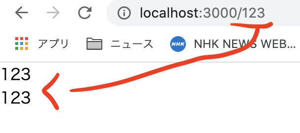
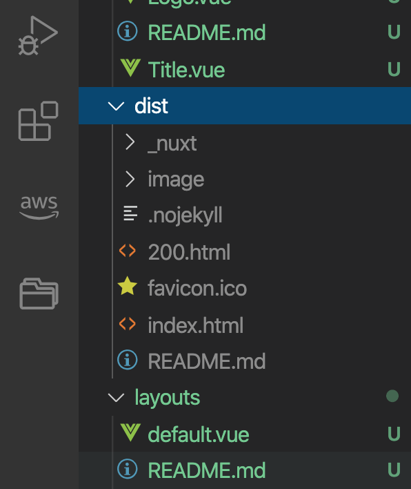

# 記事ページの雛形

## ゴール

記事ページの雛形を使い各記事ページを作成する。

## 手順

```
1.記事の雛形ページを作る
2.雛形にデータを流し込む
3.記事ページが静的サイトとして作られない
```

## 1.記事の雛形ページを作る

pages/\_id.vueを作り下記をコピペする。Vueファイルの接頭辞に「\_」があると、それは雛形ファイルであるという宣言になる。

```vue
<template>
  <section>記事の雛形ページ</section>
</template>
```

http://localhost:3000/123
にアクセスすると雛形ページが表示される。<br>
<br>
ここで123を別の数字や文字に変更しても同じページが表示される事を確認する。

## 2.雛形にデータを流し込む

```
2-1.ページのurlを取得する
2-2.urlに応じたデータを取得し表示する
2-3.cors問題を回避する
```

### 2-1.ページのurlを取得する

ページのurlを取得した上で、それに応じたデータを表示したい。まずはurlを所得する。<br>
<br>
pages/_id.vueを下記に置き換える。

```vue
<template>
  <section>
    <p>{{ asyncId }}</p>
    <p>{{ id }}</p>
  </section>
</template>
<script>
export default {
  // asyncDataとdataのthisは違うものになる！
  asyncData(context){
    return {
      asyncId: context.params.id
    }
  },
  data(){
    return {
      id: this.$route.params.id
    }
  }
}
</script>
```

下図のようにURLがページに反映されればOK



asyncDataメソッドとdataメソッドではurlの取得方法が違う。これはNuxtのライフサイクルによるもので、各メソッド内で参照出来るthisの値が変わる。<br>
<br>
Nuxtのコンポーネント（Vueファイル）がページに反映される工程（ライフサイクル）は、JSでDOMをページに追加する時と同様に、作成し、ページにappend（マウント）するというものになる。<br>
<br>
大雑把に言うとasyncDataは作成される前に実行される、dataは作成後に実行される。要は、Nuxtの同じデータにアクセスしたい場合でもメソッドによってそのアクセス方法が異なる場合があるという事を理解して貰えたらOK。

### 2-2.urlに応じたデータを取得し表示する

pages/_id.vueを下記と置き換える。

```vue
<template>
  <section>
    <h1>{{ data.title }}</h1>
    <p>{{ data.content }}</p>
  </section>
</template>
<script>
export default {
  asyncData(context){
    const id = context.params.id;
    return context.app.$axios.$get(`https://nuxt-hands-on.s3.ap-northeast-2.amazonaws.com/${id}.json`)
      .then(res => {
        console.log(res);
        return {
          data: res
        }
      })
  }
}
</script>
```

http://localhost:3000/20200904
へアクセスするとajaxで取得した内容がページに表示される。<br>
<br>
また
http://localhost:3000
へアクセスして各リンクに飛べる事も確認。

## 3.記事ページが静的サイトとして作られない

下記コマンドを続けて実行して静的サイトを作成する。

```
// ビルド
yarn build

// 静的サイトへ変換
npx nuxt build
```

dist以下にあって欲しい各記事のページが作成されていない。次章で解決する。



## 出来るようになった事

- 雛形ページの作成
- 雛形ページにデータを流し込む