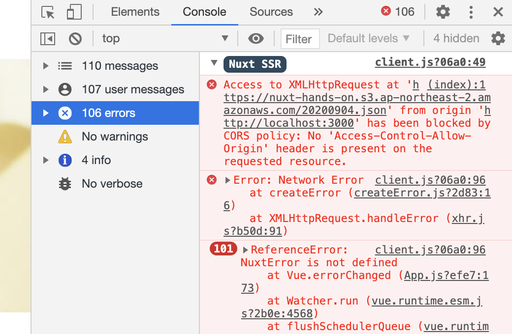

# 静的サイトを作成する

## ゴール

静的サイト作成コマンドを実行すると雛形ページにデータが流し込まれた記事ページも静的サイトとして作成される。

## 手順

```
1.aタグをnuxt-linkタグに変更する
2.雛形ページを元にした記事ページを静的サイトへ変換
3.開発モードでの不具合を直す
4.(補足)jsonを読む方法
```

## 1.aタグをnuxt-linkタグに変更する

Nuxtでのページ遷移には、`a`タグか`nuxt-link`コンポーネント（タグ）を使う。ページ中のリンク先（各記事ページ）も静的サイトとして生成したい場合は、`nuxt-link`コンポーネントを使う。挙動の大きな違いとしては、`nuxt-link`はページ遷移をリロードせずに、中身を置き換える事で実現する点。また、`nuxt-link`を使うとリンク先の先読みなどが出来る。<br>
<br>
Link.vueの\<template\>部分を下記と置き換える。

```vue
<template>
  <li class="item">
    <nuxt-link class="item__link" :to="link">
      <figure class="item__img"></figure>
      <p class="item__title">{{ title }}</p>
      <time class="item__date">{{ date }}</time>
    </nuxt-link>
  </li>
</template>
```

## 2.雛形ページを元にした記事ページを静的サイトへ変換

下記コマンドを続けて実行して静的サイトを作成する。

```
// ビルド
yarn build

// 静的サイトへ変換
npx nuxt build
```

dist以下に各記事のページが作成されている事を確認する。


## 3.開発モードでの不具合を直す

```
3-1.開発モードでの不具合を確認
3-2.corsエラーの理由
3-3.proxyの設定をする
```

### 3-1.開発モードでの不具合を確認

これで全て解決と言いたいところだが、開発者モードで立ち上げて、
http://localhost:3000
へアクセスするとページ遷移が上手く行かなくなってしまっている。<br>
<br>
またconsoleを確認すると`cors`のエラーが出ている事を確認出来る。



### 3-2.corsエラーの理由

aタグの場合は、毎回サーバーリクエストが発生するため、サーバー側でajaxリクエストが処理される。nuxt-linkの場合は、サーバーリクエストは初回のみで、ページ遷移時は、Nuxtの機能によって、よしなにされる。ページ遷移時のajaxリクエストはブラウザ側で処理される。このブラウザ側でのajaxがNuxtではcorsに引っかかる。同じドメインから取得するならば引っかかる事は無いが、今回のようにAPIサーバーからデータを取得する場合は、一工夫必要になる。

### 3-3.proxyの設定をする

corsに引っかかる問題を回避するには、nuxt.config.jsのmodulesのあたりを、下記と置き換える。

```js
  /*
  ** Nuxt.js modules
  */
  modules: [
    '@nuxtjs/axios',
    '@nuxtjs/proxy'
  ],
  proxy : {
    '/api': {
      target: 'https://nuxt-hands-on.s3.ap-northeast-2.amazonaws.com',
    }
  },
```

Nuxtアプリからの直接のcorsリクエストが許されないので、代わりにcorsリクエストしてくれるツール（モジュール）にcorsリクエストを任せる。上記はその設定。<br>
<br>
AxiosでAjaxリクエストを送るurlが`/api`で始まる場合、`target`に書かれたURLへリクエストを投げる。

### 3-4.proxyを使いcorsリクエストをする

pages/index.vueの\<script\>を下記と置き換える。

```vue
<script>
export default {
  asyncData(context) {
    return context.app.$axios.$get("/api/list.json")
      .then(res => {
        console.log(res)
        return {
          list: res
        }
      })
  }
}
</script>
```

pages/\_id.vueの\<script\>を下記と置き換える。

```vue
<script>
export default {
  asyncData(context){
    const id = context.params.id;
    return context.app.$axios.$get(`/api/${id}.json`)
      .then(res => {
        console.log("なぜか取れるね");
        console.log(res);
        return {
          data: res
        }
      })
  }
}
</script>
```

開発者モードでも不具合無く動くようになっていればOK。

## 4.(補足)jsonを読む方法

- 普通にstaticにjsonを置いて読むのではダメなのか？

staticにあるファイルには、開発者モードで立ち上げた上で
localhost:3000/data/list.json
のように取得出来るが、逆に言えば、開発者モードを止めている場合は、アクセスが出来ない。例えば、開発者モードを止めてbuildする場合に、失敗する（ターミナルを複数立ち上げて、開発者モードを続けつつ、buildするならば可能）。


- ローカルにデータを置けばajaxじゃなくてrequireとかimportで読めるんじゃない？

結論、出来る。ただし、キャッシュを持つので、変更したデータを反映したい場合に、.nuxtディレクトリに存在する、キャッシュファイルを削除する処理が必要になる。

- API経由ではなくローカルのデータを上手く読む方法無いの？

Nuxtプロジェクト内に、APIサーバーを作ることが出来る。node.jsのExpress製のAPIサーバー。このプロジェクト内に内蔵したサーバーを使えばproxyの設定は不要になる。ただし、Expressでサーバーを立てる必要がある。

## 出来るようになった事

- 雛形ページからの静的サイトの作成
- cors対策のproxyの設定