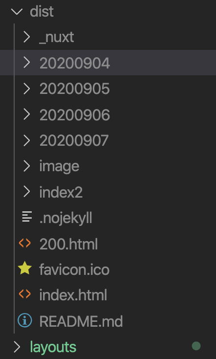

# 静的サイトを作成する

## ゴール

雛形から静的なHTMLページを作成出来る

## 静的サイトを作成

下記コマンドを続けて実行

```
yarn build

npx nuxt generate
```

記事ページが作成されていないことを確認する


## aタグをnuxt-linkタグに変更

pages/Link.vueのaタグを下記と置き換える

```vue
<nuxt-link class="item__link" :to="name">
  <figure class="item__img"></figure>
  <p class="item__title">{{ title }}</p>
  <time class="item__date">{{ date }}</time>
</nuxt-link>
```

## 再び静的サイトを作成

今度は記事ページも作成される


